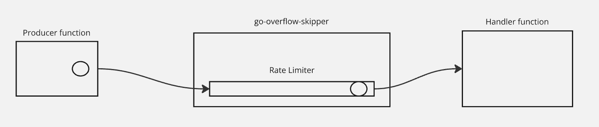
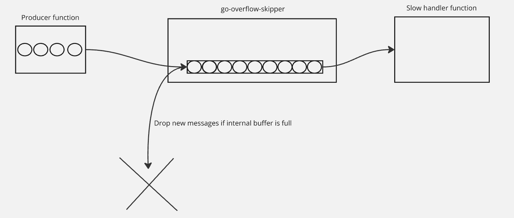

# skipping-rate-limiter-go
Simple lossy none-blocking rate limiter which skips messages on pushback form handlers. Rate limit applied only for skipped messages.

# Problem to solve

Imagine we have 2 functions: first produces messages (Producer), second consumes the messages (Consumer).

If Consumer starts to process messages slowly, we want to skip new messages, just discard it. 
But after some number of buffered messages.

This could be useful if we're getting some stream of messages from external source but we could safely discard some messages in case of really huge incoming stream.


So, if Consumer quick enough to process all the incoming messages, we have almost empty internal buffer.
<p style="text-align:center">
  
</p>

In case of Consumer is slow, our internal buffer is full, and that is a trigger for pushback skipping strategy (meaning Consumer pushed back new messages and Overflow Skipper discards new messages from Producer).
<p style="text-align:center">
  
</p>


# Usage example

```go

	ctx, cancel := context.WithTimeout(context.Background(), 2*time.Second)
	defer cancel()
	throttler := NewThrottle[Message](10, time.Second)

	throttler.messageHandler = func(msg Message) {
		fmt.Printf("got in handler: %+v\n", msg)
		time.Sleep(time.Millisecond * 100)
	}
	throttler.skipMessageCallback = func(skippedMsgCount uint64) {
		fmt.Printf("skippedMsgCount: %d\n", skippedMsgCount)
	}

	throttler.messageProducer = func(ctx context.Context) (Message, error) {
		time.Sleep(time.Millisecond * 50)
		return Message{
			ID:      "1",
			Message: "hello world",
		}, nil
	}

	err := throttler.Run(ctx)
	if err != nil {
		log.Fatalln(err)
	}
```